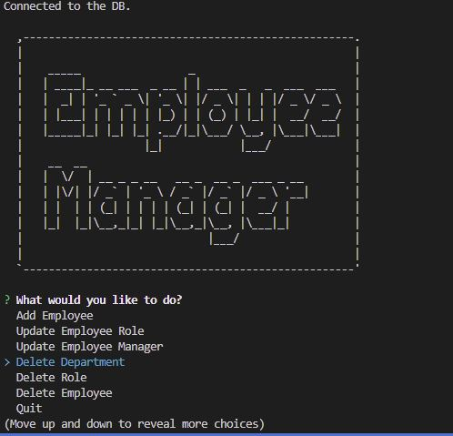

##### Challenge: SQL: Employee Tracker

# Functionality:
        When i start the application i am able to see a large logo of employee manager, then i get the prompts for managing my employees, 
        The functionality includes:

                                    View All Departments
                                    View All Roles
                                    View All Employees
                                    View Employees By Manager
                                    View Employees By Department
                                    Add Department
                                    Add Role
                                    Add Employee
                                    Update Employee Role
                                    Update Employee Manager
                                    Delete Department
                                    Delete Role
                                    Delete Employee
                                    Quit

        The data has been fetched from MYSQL database using mysql2.0 node package, and the command prompts are being displayed on the screen using the inquirer package as we have previosuly used in the assignments. asciiart-logo node package has been used to display the big logo on the start and quit of application. console table has been used to display the data from the database in the form of tabular view.

# Screen Test

# User Story:
    AS A business owner
    I WANT to be able to view and manage the departments, roles, and employees in my company
    SO THAT I can organize and plan my business

# Acceptance Criteria:

    GIVEN a command-line application that accepts user input
    WHEN I start the application
    THEN I am presented with the following options: view all departments, view all roles, view all employees, add a department, add a role, add an employee, and update an employee role
    WHEN I choose to view all departments
    THEN I am presented with a formatted table showing department names and department ids
    WHEN I choose to view all roles
    THEN I am presented with the job title, role id, the department that role belongs to, and the salary for that role
    WHEN I choose to view all employees
    THEN I am presented with a formatted table showing employee data, including employee ids, first names, last names, job titles, departments, salaries, and managers that the employees report to
    WHEN I choose to add a department
    THEN I am prompted to enter the name of the department and that department is added to the database
    WHEN I choose to add a role
    THEN I am prompted to enter the name, salary, and department for the role and that role is added to the database
    WHEN I choose to add an employee
    THEN I am prompted to enter the employee’s first name, last name, role, and manager, and that employee is added to the database
    WHEN I choose to update an employee role
    THEN I am prompted to select an employee to update and their new role and this information is updated in the database 

# Guide Video link:
Please open the given link in the browser to display the guidance to use the application video

# Contact Me:
If you want to contact me please email me at the given email address:
                syedali05125569@gmail.com